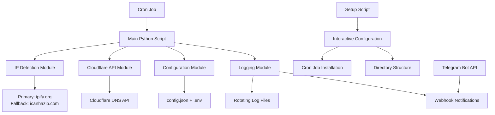

# System Architecture Overview - Auto-DDNS for Home Laboratories

## Project Overview

This document outlines the system architecture for the Auto-DDNS (Dynamic DNS) solution designed for home laboratories, specifically targeting Proxmox environments that require stable remote access despite dynamic IP changes from ISPs.

## Architecture Diagram



## Core Components

### 1. Main Application Layer
- **Language**: Python 3.8+
- **Architecture**: Single-script approach for simplicity
- **Entry Point**: `auto_ddns.py` - orchestrates the entire DDNS update process
- **Design Philosophy**: Minimal dependencies, maximum reliability

### 2. IP Detection Module
- **Primary Service**: ipify.org API (`https://api.ipify.org`)
- **Secondary Service**: ipify.org API (`https://ifconig.io`) (using a bas command curl -4 ifconfig.io and it will return the IPv4 address )
- **Fallback Service**: icanhazip.com (`https://icanhazip.com`)
- **Retry Logic**: 3 attempts with 5-second delays between retries
- **Validation**: IP format verification using regex patterns
- **Error Handling**: Graceful fallback between services

### 3. Cloudflare Integration Module
- **API Client**: Using Python `requests` library
- **Authentication**: API token-based authentication
- **Zone Management**: Automatic zone ID detection based on domain
- **Record Management**: A record creation and update logic
- **Rate Limiting**: Respects Cloudflare API limits with exponential backoff

### 4. Configuration Management
- **Primary Config**: `config.json` for main settings
- **Sensitive Data**: `.env` file for API tokens and secrets
- **Validation**: Configuration validation on script startup
- **Interactive Setup**: Guided configuration through `setup.py`

### 5. Logging & Monitoring System
- **Log Format**: Structured text logs with timestamps
- **Log Rotation**: Daily log files with 7-day retention
- **Log Levels**: INFO, WARNING, ERROR, SUCCESS
- **File Management**: Automatic cleanup of old log files
- **Size Limits**: Maximum 10MB per log file

## File Structure

```
cloudflare-dns-local-ip/
├── auto_ddns.py              # Main script (single file approach)
├── config/
│   ├── config.json           # Main configuration
│   └── .env                  # Environment variables (API tokens)
├── setup.py                  # Interactive setup script
├── logs/                     # Log directory (auto-created)
├── docs/                     # Documentation
│   └── system-architecture.md
├── requirements.txt          # Python dependencies
├── install.sh               # One-click installation
└── README.md                # User documentation
```

## Core Functions Architecture

### Main Script Functions (`auto_ddns.py`)

```python
def get_current_public_ip():
    """
    Detects current public IP using multiple services
    Returns: IP address string or None if all services fail
    """

def get_cloudflare_record():
    """
    Fetches current DNS A record from Cloudflare
    Returns: Current IP in DNS record or None if not found
    """

def update_cloudflare_record(new_ip):
    """
    Updates Cloudflare DNS A record with new IP
    Returns: Boolean success status
    """

def setup_logging():
    """
    Configures rotating log system
    Creates log directory if needed
    """

def send_telegram_alert(message):
    """
    Sends notification via Telegram webhook
    Optional feature for monitoring
    """

def main():
    """
    Main orchestration logic:
    1. Get current public IP
    2. Get current DNS record IP
    3. Compare and update if different
    4. Log results and send notifications
    """
```

## Configuration Strategy

### Main Configuration (`config.json`)
```json
{
  "domain": "lab.yourdomain.com",
  "cloudflare": {
    "zone_id": "auto-detect",
    "record_name": "lab"
  },
  "ip_services": [
    "https://api.ipify.org",
    "https://icanhazip.com"
  ],
  "logging": {
    "level": "INFO",
    "max_files": 7,
    "max_size_mb": 10
  },
  "telegram": {
    "enabled": true,
    "webhook_url": "from_env"
  }
}
```

### Environment Variables (`.env`)
```bash
CLOUDFLARE_API_TOKEN=your_api_token_here
TELEGRAM_WEBHOOK_URL=https://api.telegram.org/bot<token>/sendMessage
```

## Deployment Strategy

### Installation Method: Direct Script Execution
- **Approach**: Standalone Python script deployment
- **Benefits**: Simple, no package management, easy troubleshooting
- **Target**: Home lab environments with minimal complexity

### Scheduling: Cron Jobs
```bash
# Run every hour at minute 0
0 * * * * /usr/bin/python3 /path/to/auto_ddns.py >> /path/to/logs/cron.log 2>&1
```

### Setup Process
1. **Interactive Configuration**: Run `setup.py` for guided setup
2. **Automatic Cron Installation**: Script installs cron job automatically
3. **Validation**: Test run to verify connectivity and permissions

## Error Handling & Resilience

### Network Resilience
- **Multiple IP Services**: Primary and fallback IP detection services
- **Retry Mechanism**: 3 attempts with progressive delays
- **Timeout Handling**: 10-second timeout per request
- **Connection Validation**: Verify internet connectivity before API calls

### API Resilience
- **Cloudflare API Errors**: Handle 4xx and 5xx HTTP responses
- **Rate Limiting**: Respect 429 responses with exponential backoff
- **Authentication Errors**: Clear error messages for invalid tokens
- **DNS Record Management**: Handle missing records gracefully

### System Resilience
- **Dependency Checking**: Validate required Python modules on startup
- **File Permissions**: Handle read/write permission issues
- **Configuration Validation**: Verify config file format and required fields
- **Resource Management**: Minimal memory footprint, efficient execution

## Monitoring & Observability

### Logging Strategy
- **Log Rotation**: Daily files with automatic cleanup
- **Retention Policy**: Keep 90 days of logs
- **Log Levels**: Structured logging with appropriate levels
- **Error Context**: Detailed error information for troubleshooting

### Log Format Example
```
2025-01-08 17:30:01 [INFO] Starting DDNS update check
2025-01-08 17:30:02 [INFO] Current public IP: 203.0.113.45
2025-01-08 17:30:03 [INFO] Cloudflare record IP: 203.0.113.44
2025-01-08 17:30:04 [INFO] IP changed, updating DNS record
2025-01-08 17:30:05 [SUCCESS] DNS record updated successfully
2025-01-08 17:30:06 [INFO] Telegram notification sent
```

### Metrics Collection
- **Success/Failure Rates**: Track update success percentage
- **Response Times**: Monitor API response performance
- **IP Change Frequency**: Track how often IP addresses change
- **System Health**: Monitor script execution reliability

### Metrics Storage (`metrics.json`)
```json
{
  "last_run": "2025-01-08T17:30:05Z",
  "total_runs": 168,
  "successful_updates": 12,
  "failed_attempts": 2,
  "current_ip": "203.0.113.45",
  "last_ip_change": "2025-01-07T14:22:10Z",
  "avg_response_time_ms": 245
}
```

## Security Architecture

### Credential Management
- **Environment Variables**: Store sensitive data in `.env` files
- **File Permissions**: Restrict access to configuration files (600)
- **No Hardcoded Secrets**: All sensitive data externalized
- **API Token Scope**: Use minimal required Cloudflare permissions

### API Security
- **HTTPS Only**: All external communications over HTTPS
- **Token Validation**: Verify API token format and permissions
- **Request Signing**: Use proper authentication headers
- **Error Sanitization**: Prevent credential exposure in logs

## Future Enhancements

### Alerting System
- **Telegram Integration**: Webhook-based notifications
- **Alert Types**: IP changes, failures, weekly summaries
- **Notification Filtering**: Configurable alert thresholds

### Advanced Features
- **Multiple Domain Support**: Handle multiple DNS records
- **Health Check Endpoint**: HTTP endpoint for monitoring systems
- **Configuration Hot Reload**: Update settings without restart
- **IPv6 Support**: Dual-stack IP detection and updates

## Dependencies

### Python Requirements
```
requests>=2.25.0
python-dotenv>=0.19.0
```

### System Requirements
- Python 3.8 or higher
- Internet connectivity
- Cron daemon (standard on Linux systems)
- Write permissions for log directory

## Success Criteria

1. **Reliable Execution**: Script runs hourly without failures
2. **Accurate IP Detection**: Correctly identifies public IP changes
3. **Successful DNS Updates**: Cloudflare records reflect current IP
4. **Stable Remote Access**: VPN connections work consistently
5. **Comprehensive Logging**: Clear audit trail of all operations
6. **Easy Maintenance**: Simple troubleshooting and configuration updates

This architecture provides a robust, maintainable solution for automatic DNS updates in home laboratory environments, ensuring reliable remote access despite dynamic IP changes.
